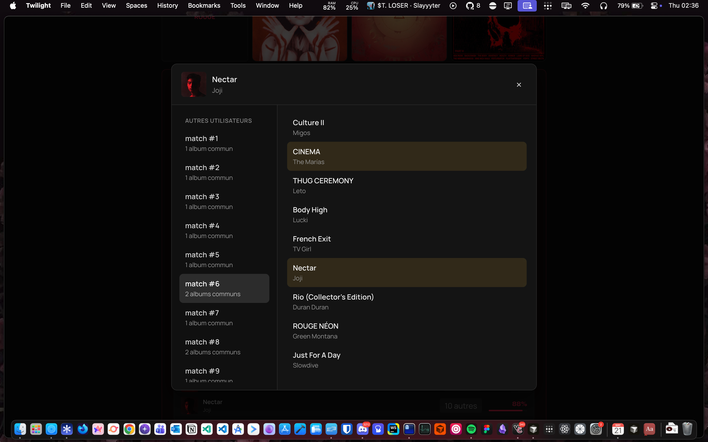

# barrzz hook

## Installation

1. Installez l'extension [Violentmonkey](https://violentmonkey.github.io/)
2. Installez le script [barrzz_hook.user.js](https://github.com/busybox11/barrzz_hook/releases/latest/download/barrzz_hook.user.js)

